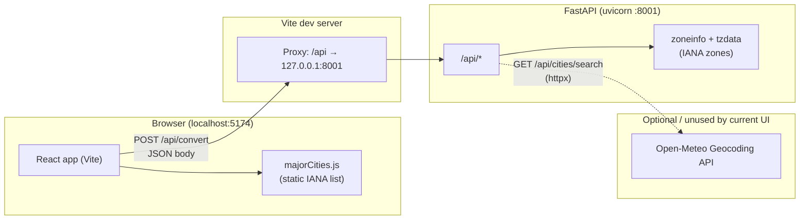
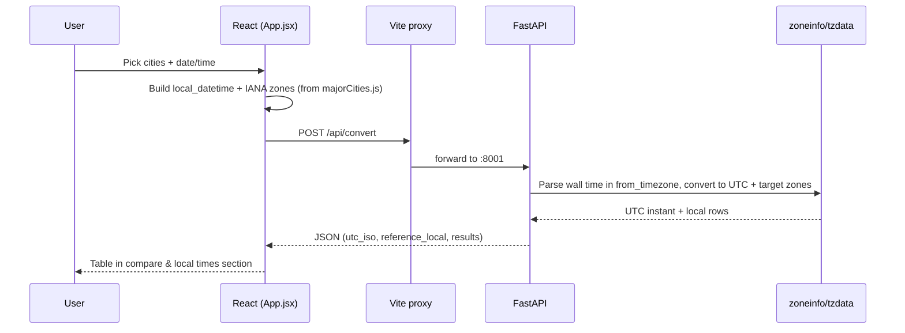

# TimeZoneChecker — system architecture

Overview of how the app is structured: **React (Vite) frontend**, **FastAPI backend**, and **dev-time proxy**. There is **no database**; city choices come from a **static list** in the frontend, and conversion uses **IANA timezones** via Python’s `zoneinfo` (with the **`tzdata`** package on Windows).

## High-level diagram

## Convert flow (main path)

## Components

| Piece | Role |
|--------|------|
| **React + Vite** | UI; city pickers use **`frontend/src/data/majorCities.js`** only (no network for city lists). |
| **Vite `proxy`** | In dev, **`/api` → `http://127.0.0.1:8001`** (see `frontend/vite.config.js`) so the client can call `fetch('/api/convert')`. |
| **FastAPI** | **`POST /api/convert`** performs timezone math with IANA names via **`zoneinfo`** (install **`tzdata`** on Windows). |
| **`GET /api/cities/search`** | Proxies to **Open-Meteo**; the **current UI does not use it** after switching to the static major-cities list. |
| **`GET /api/health`** | Liveness check for the API process. |

## Production note

For a production build, serve `frontend/dist` behind a host that **reverse-proxies `/api`** to the FastAPI service, or configure a full API base URL in the client if origins differ.
