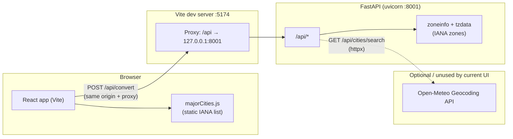
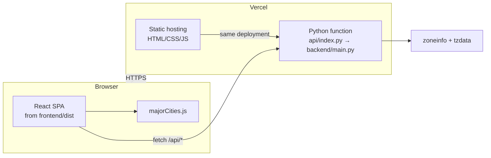
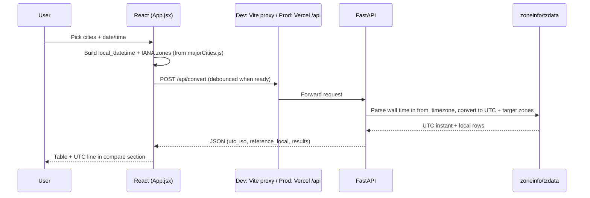

# TimeZoneChecker — system architecture

The app is a **single-page React (Vite) UI** with a **FastAPI** API. There is **no database**: reference and comparison cities come from a **static list** (`majorCities.js`), and conversion uses **IANA timezones** in Python via **`zoneinfo`** (with the **`tzdata`** package where the OS does not ship IANA data).

## Runtime: development vs production

| Environment | Frontend | API |
|-------------|----------|-----|
| **Local dev** | Vite dev server (default port **5174**) | `uvicorn` on **8001**; Vite **proxies** `/api` → `127.0.0.1:8001` (`frontend/vite.config.js`). |
| **Production (Vercel)** | Static files from **`frontend/dist`** | Python **serverless** `api/index.py` imports **`app`** from `backend/main.py`; `vercel.json` rewrites `/api/*` to that function. Same origin as the UI — no separate API URL in the client. |

See **[deployment.md](deployment.md)** for Vercel project layout and troubleshooting.

## High-level diagram (development)

## High-level diagram (production on Vercel)

## UI structure (frontend)

The screen is organized into two cards (see **`frontend/src/App.jsx`**):

1. **Reference city & time** — city combobox (from `majorCities.js`), date and time (react-datepicker + naive local time for the chosen zone).
2. **Compare & local times** — add comparison cities (same static list), chips to remove, then results: summary, table (reference row + targets), UTC instant, **copy to clipboard** (HTML table + plain text when supported), and actions (e.g. edit / start over).

There is **no manual “Convert” button**: when the form is complete, a **debounced** effect (~450 ms) calls **`POST /api/convert`** so results stay in sync while editing.

## Convert flow (main path)

## Components

| Piece | Role |
|--------|------|
| **React + Vite** | UI; city pickers use **`frontend/src/data/majorCities.js`** only (no network for city lists). |
| **Vite `proxy`** | In dev, **`/api` → `http://127.0.0.1:8001`** (`frontend/vite.config.js`) so `fetch('/api/convert')` works without CORS. |
| **FastAPI** | **`POST /api/convert`** performs timezone math with IANA names via **`zoneinfo`** (install **`tzdata`** on Windows if needed). |
| **`GET /api/cities/search`** | Proxies to **Open-Meteo**; the **current UI does not use it** (static major-cities list only). |
| **`GET /api/health`** | Liveness check for the API process. |
| **`api/index.py` (Vercel)** | Re-exports the same FastAPI **`app`** for serverless; must expose ASGI as **`app`**. |
| **`vercel.json` + root `requirements.txt`** | Build static frontend, route `/api/*` to the Python function, pin Python deps for the serverless runtime. |

## Production without Vercel

Serve **`frontend/dist`** from any static host and **reverse-proxy `/api`** to a process running **`uvicorn main:app`** (or equivalent), **or** point the client at a full API base URL if the UI and API use different origins (the stock client uses relative **`/api`** only).
